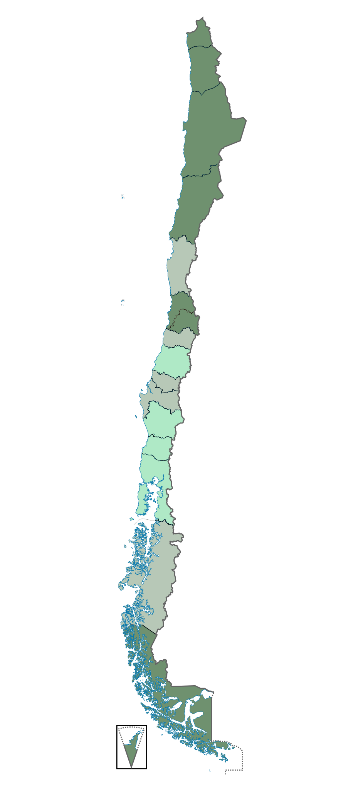
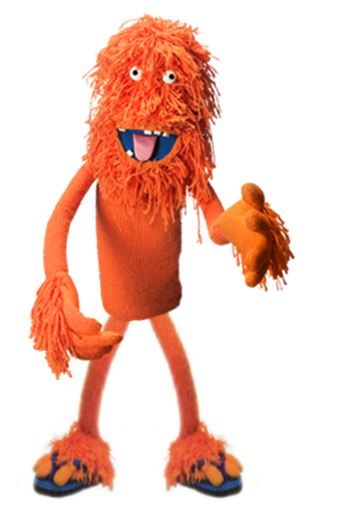
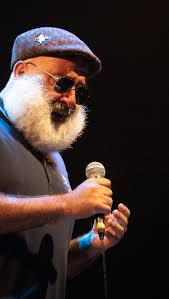

# Todas nuestras publicaciones

::: {.escritos-page-layout}
::: {.escritos-main}
::: {#escritos}
:::
:::

::: {.escritos-side}
{.escritos-side-image}




:::
:::

```{=html}
<section class="escritos-subscribe">
  <div class="escritos-subscribe-inner">
    <h2 class="escritos-subscribe-title">Suscríbete y te avisamos de nuevas publicaciones</h2>
    <form class="escritos-subscribe-form" action="#" method="POST" onsubmit="return false;">
      <input type="email" name="email" placeholder="Ingresa tu correo" aria-label="Correo electrónico" required>
    </form>
  </div>
</section>
```
```{=html}
<script>
document.addEventListener('DOMContentLoaded', function () {
  const mainCol = document.querySelector('.manifiesto-main');
  const spotify = document.getElementById('manifiesto-spotify');
  const playlistTitle = document.querySelector('.manifiesto-playlist-title');
  if (!mainCol || !spotify) return;

  function syncPlaylistHeight() {
    if (window.innerWidth <= 880) {
      spotify.style.height = '152px';
      return;
    }
    const titleHeight = playlistTitle ? playlistTitle.offsetHeight : 0;
    const targetHeight = Math.max(mainCol.offsetHeight - titleHeight - 10, 0);
    spotify.style.height = targetHeight + 'px';
  }

  syncPlaylistHeight();
  setTimeout(syncPlaylistHeight, 250);
  window.addEventListener('resize', syncPlaylistHeight);
  window.addEventListener('load', syncPlaylistHeight);
});
</script>
```